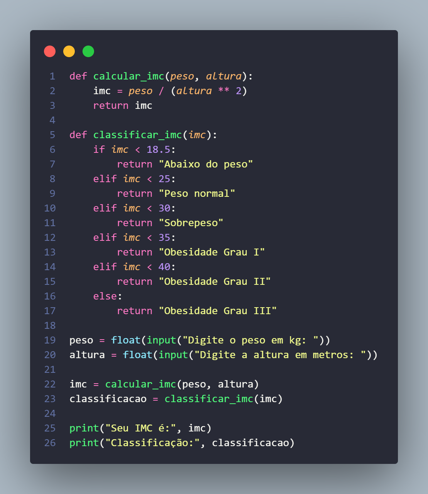

# Exercício da Proz em python

# Cálculo do Índice de Massa Corporal (IMC)

Este é um programa simples em Python que permite calcular o Índice de Massa Corporal (IMC) com base no peso e na altura fornecidos. O IMC é uma medida que avalia a relação entre o peso e a altura de uma pessoa e é amplamente utilizado para determinar se alguém está dentro de faixas consideradas saudáveis.

## Como funciona?

O programa começa definindo duas funções: `calcular_imc` e `classificar_imc`. 

A função `calcular_imc` recebe o peso e a altura como parâmetros e retorna o valor do IMC calculado. A fórmula para o cálculo do IMC é: peso / (altura ** 2). 

A função `classificar_imc` recebe o valor do IMC como parâmetro e retorna uma classificação correspondente com base nos padrões comumente adotados. As classificações incluem "Abaixo do peso", "Peso normal", "Sobrepeso", "Obesidade Grau I", "Obesidade Grau II" e "Obesidade Grau III".

No programa principal, solicitamos que o usuário forneça o peso em quilogramas e a altura em metros. Em seguida, chamamos a função `calcular_imc` para obter o valor do IMC com base nos dados fornecidos. Em seguida, usamos a função `classificar_imc` para determinar a classificação correspondente ao IMC calculado.

Por fim, o programa imprime na tela o valor do IMC e sua classificação.

## Executando o programa

Para executar o programa, você precisará ter o Python instalado em seu ambiente. Siga estas etapas:

1. Copie o código fornecido abaixo para um arquivo com a extensão `.py` (por exemplo, `calculo_imc.py`).
2. Abra um terminal ou prompt de comando.
3. Navegue até o diretório onde o arquivo `.py` foi salvo.
4. Execute o programa digitando `python calculo_imc.py` e pressione Enter.
5. Insira o peso em quilogramas e a altura em metros quando solicitado.
6. O programa calculará o IMC e exibirá o resultado na tela, juntamente com a classificação correspondente.

Sinta-se à vontade para utilizar este código como referência ou adaptá-lo para suas próprias necessidades. Divirta-se!

Clique em 👉 [Google Colabory](https://colab.research.google.com/drive/1o93y5-TZmXlbCjcMRSmfRDBvAxWhrG5X?authuser=1#scrollTo=xpABgeN3KRn-) 👈 para acessar o exercutavel online.

<table>
  <tr>
    <th>SCREENSHOT RESPOSTA</th>
  </tr>
  <tr>
    <td>
        

            
        

    </td>
  </tr>